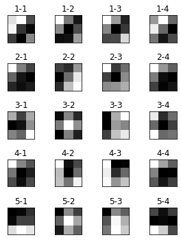
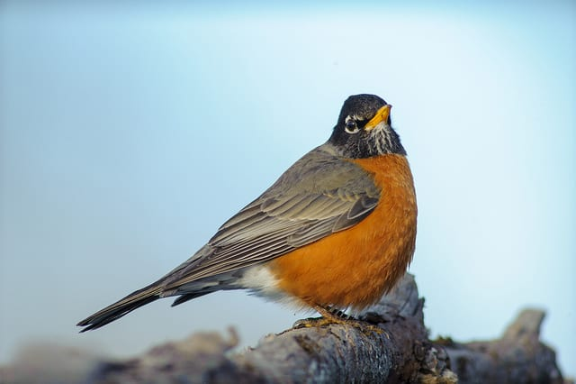
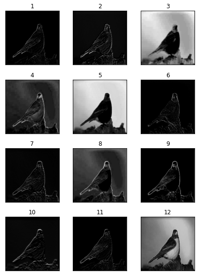

# Visualize Convolution Filters and Feature Maps
----------------------------------------------------
This Python script, visualize VGG19 Filters and Feature Maps.

Filters:
----------------------------------------------------
some fitlers for second convolutional layer:

Feature Maps:
----------------------------------------------------
some feature maps for second convolutional layer:

Main Images:

Feature Maps:

