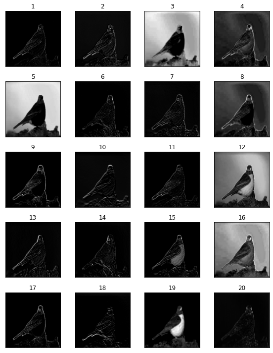

# Visualize Filters and Feature Maps in CNN
----------------------------------------------------
This Python script, visualize filters and feature maps in VGG19.

Filters:
----------------------------------------------------
Some filters of the second convolutional layer:

Feature Maps:
----------------------------------------------------
Some feature maps of the second convolutional layer:

Main Image:

Feature Maps:

